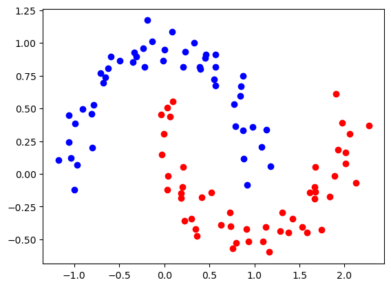
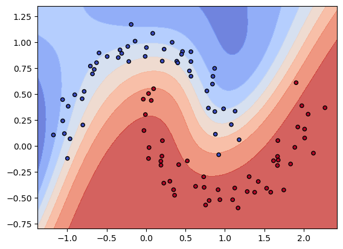

# nn_from_scratch

An auto-differentiation engine and neural network architecture built from only `numpy` to demonstrate foundational knowledge of ML. 

### Auto-differentiation
The `Node` class stores a value and gradient. The value can be manipulated through common operations. The gradient is automatically updated when backpropagation is called. Below is an example:
```python
from nn_from_scratch.node import Node

a = Node(2.0)
b = Node(-3.0)
c = Node(1.0)
d = a * b
e = d - c
print(e.value) # prints -7.0 (result of the forward pass)
e.backprop()
print(a.grad) # prints -3.0 (de/da)
print(b.grad) # prints 2.0 (de/db)
print(c.grad) # prints -1.0 (de/dc)
print(d.grad) # prints 1.0 (de/dd)
```

### Training a neural network
The `MLP` class provides the architecture to build a multi-layer perception model. Below is an example of binary classification:
```python
import matplotlib.pyplot as plt
from sklearn.datasets import make_moons

X, Y = make_moons(n_samples=100, noise=0.1, random_state=42)
plt.figure()
plt.scatter(X[Y == 0, 0], X[Y == 0, 1], color='blue')
plt.scatter(X[Y == 1, 0], X[Y == 1, 1], color='red')
```
</br></br>
Initializing and training the model
```python
model = MLP([2, 16, 16, 1])
num_iter = 100
learning_rate = 1e-3
for k in range(num_iter):
    # forward pass
    ypred = [model(x) for x in X]
    loss = sum((y_a - y_p)**2 for y_a, y_p in zip(Y, ypred))
    # backpropagation
    for p in model.parameters():
        p.grad = 0 
    loss.backprop()
    # update model
    for p in model.parameters():
        p.value += -learning_rate * p.grad
    # track training loss
    if k % 10 == 0:
        print(f"Iter {k}: Loss {loss.value:.4f}")
```
```bash
Iter 0: Loss 83.8247
Iter 10: Loss 11.5137
Iter 20: Loss 9.0155
Iter 30: Loss 7.0642
Iter 40: Loss 5.4826
Iter 50: Loss 4.4820
Iter 60: Loss 3.8770
Iter 70: Loss 3.4857
Iter 80: Loss 3.2109
Iter 90: Loss 3.0044
Iter 100: Loss 2.8409
```
Visualizing the model's decision boundary
```python
x_min, x_max = X[:, 0].min() - 1, X[:, 0].max() + 1
y_min, y_max = X[:, 1].min() - 1, X[:, 1].max() + 1
h = 0.05
xx, yy = np.meshgrid(np.arange(x_min, x_max, h),
                     np.arange(y_min, y_max, h))
Z = np.c_[xx.ravel(), yy.ravel()]
Z = np.array([model(z).value for z in Z])
Z = Z.reshape(xx.shape)
plt.contourf(xx, yy, Z, alpha=0.8, cmap=plt.cm.coolwarm)
plt.scatter(X[:, 0], X[:, 1], c=Y, edgecolors='k', marker='o', s=20, cmap=plt.cm.coolwarm)
```

